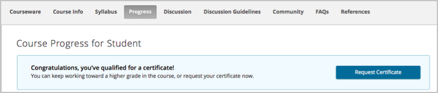
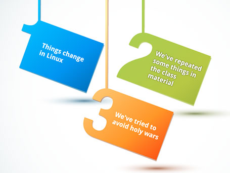

# Introducción y Bienvenida

## Introducción

## Antes de empezar

El objetivo de este curso es ayudarlo a familiarizarse con el **sistema** operativo **Linux** . Está diseñado para llevarte mucho más allá de ser un usuario personal e informal de **Linux** . Comenzará con los fundamentos y el progreso para explorar las diversas herramientas y técnicas comúnmente utilizadas por los usuarios, programadores y administradores de sistemas de Linux para hacer su trabajo diario.

También notará rápidamente algunas convenciones de formato. Utilizamos texto en negrita para indicar **nombres de programa** o **software**  y formato de monoespacio para `entradas que van en la línea de comando`. 

## Bienvenido al mundo de Linux

Felicidades por embarcarse en un viaje para aprender **Linux**. Esperamos que estés tan inspirado como nosotros.

## Plan de estudios y calificación

El programa completo de este curso se puede descargar [aquí](https://github.com/carlosal1015/LinuxFoundationX-LFS101x/blob/master/References/LFS101x_-_Introduction_to_Linux_Outline.pdf). Como este curso es completamente personalizado, incluimos muchas preguntas, actividades y laboratorios para ayudarlo a practicar las habilidades a medida que las adquiere.

> Para completar este curso con una calificación aprobatoria, debe obtener una calificación aprobatoria en el Examen Final de un mínimo del 70%.

Tendrás un máximo de 2 intentos para responder cada pregunta en el examen. Es un examen de libro abierto (lo que significa que es libre de hacer referencia a sus notas, pantallas del curso, etc.), y no hay un límite de tiempo sobre cuánto tiempo puede dedicar a una pregunta o en todo el examen. Siempre puedes omitir una pregunta y volver a ella más tarde.

## Progreso del curso, finalización y certificados

El objetivo de este curso es ayudar a los usuarios a desarrollar sus habilidades en **Linux**. Como resultado, hay muchas oportunidades para practicar lo que ha aprendido utilizando las preguntas de verificación de conocimientos, simulaciones "Pruébelo usted mismo" y laboratorios (con soluciones incluidas), que no están calificados, y no cuentan para la calificación final aprobatoria (solo el examen final lo hace). Un efecto secundario de esto es que la **página de progreso del curso permanecerá en blanco hasta que tome el examen final**. No te preocupes, así es como está diseñada la plataforma.

Una vez que haya completado el examen, querrá saber si ya pasó. Podrá ver su estado de finalización utilizando la pestaña "Progreso" en la parte superior de la pantalla, que indicará claramente si alcanzó o no un puntaje de aprobación. Haga clic [aquí](../images/Student_progress.png)  para ver una muestra de esta pantalla en una nueva pestaña.

Los certificados de finalización (Certificados Verificados) están disponibles una vez que obtiene una calificación aprobatoria. Una vez que lo haya hecho, puede solicitar el certificado en su página "Progreso". Una vez que se completa la solicitud (que puede demorar hasta 48 horas), puede regresar al mismo lugar y descargar su certificado. Las imágenes a continuación proporcionan una guía de cómo se verá esto.

**Sugerencia**: si necesita demostrar una constancia de finalización antes de que se genere su certificado, le recomendamos que tome una captura de pantalla de la página de progreso del curso.

## Cronología del curso

Este curso es completamente personalizado; no hay un horario fijo para examinar el material. Puede seguir el curso a su propio ritmo, y siempre regresará a donde lo dejó cuando regrese para comenzar una nueva sesión. No hay un período específico de tiempo en el que deba finalizar. Habiendo dicho eso, la clave para obtener el máximo provecho de este (o cualquier) curso es tener una rutina. Según su cronograma, puede pasar tal vez una hora al día o tal vez un par de horas cada fin de semana. Sea lo que sea, intenta seguir con eso. De esta forma, descubrirá que es mejor recordar lo que se ha cubierto anteriormente y está en mejores condiciones para digerir el nuevo material.

Los capítulos del curso se diseñaron para complementarse unos con otros, comenzando con algunos elementos básicos y avanzando hacia temas más avanzados. Probablemente sea mejor trabajar en ellos en secuencia para minimizar la confusión. Si omite o solo revisa algunos capítulos rápidamente, es posible que encuentre temas sobre los que aún no haya estado expuesto. Pero esto es todo a su propio ritmo y siempre puede regresar, por lo que puede enrutar su propio camino a través del material.

## Ayudas para el aprendizaje

Además de la exposición simple a través de texto y figuras, este curso utiliza varios métodos adicionales para presentar el material de aprendizaje.

### Videos

Hay muchos videos de demostración para ayudarlo a comprender los procedimientos, así como un video introductorio para cada capítulo. Los pasos y procedimientos exactos pueden variar un poco, de acuerdo con su distribución específica de Linux. Además, a menudo hay más de una forma de hacer algo, así que no interpretes los videos como algo que se debe seguir rigurosamente. Es posible que desee hacer clic en elbotón CC para ver los subtítulos, o aumentar la velocidad de reproducción para que tome menos tiempo. Haga clic [aquí](../images/Welcome_Chapter_Video_screencapture.jpg) para ver sugerencias adicionales.

### Pruébelo usted mismo

En estas actividades, se le pide que realice ciertas tareas, y se verifica su entrada para ver si es correcta, con comentarios específicos proporcionados si no es así. Estos no están destinados a reemplazar el laboratorioejercicios, sino simplemente para proporcionar algunas oportunidades provisionales para practicar. Para evitar que los archivos multimedia subyacentes se vuelvan demasiado grandes y complejos, usamos un algoritmo muy lineal, que solo reconoce la respuesta específica cubierta en el material. No te desanimes si escribes algo que crees que debería funcionar, pero se muestran comentarios sobre una respuesta sugerida diferente. No necesariamente significa que lo que ingresó no funcionaría en el mundo real. De hecho, te recomendamos que experimentes con los ejercicios en tu sistema Linux en vivo una vez que hayas hecho un pase inicial a través de la simulación; esto te dará la libertad de experimentar con otras variaciones y ver qué funciona. También, tenga en cuenta que los usuarios de Linux más avanzados a veces conocerán otras formas (a menudo más complicadas) de hacer cosas que simplemente no se pueden incorporar en estas simulaciones. Tales veteranos experimentados, por supuesto, no son el público objetivo para este curso.

### Comprobación del conocimiento

En estas secciones, se le pide que responda preguntas cortas (generalmente de opción múltiple) para ver si ha captado la discusión anterior. De lo contrario, es posible que se pierda un poco a medida que avanza más. Una vez más, puede haber un caso en el que brinde una respuesta levemente diferente pero correcta, y se le informa incorrectamente que está equivocado, aunque hemos intentado minimizar las preguntas de relleno por esa razón. ¡Recuerda que no estás siendo calificado!

## Ejercicios de laboratorio

En todos los cursos de la **Linux Foundation** (en cualquier formato) ponemos un gran énfasis en aprender haciendo. En las clases en vivo dirigidas por un instructor, casi siempre buscamos un equilibrio de 50/50 entre la lectura y la discusión, y trabajar en ejercicios de laboratorio o tareas que realizan las tareas que se acaban de describir en la clase o intentan variaciones más ambiciosas. Los instructores ayudan a los estudiantes a descubrir cómo hacer cosas, depurar sus códigos y scripts, etc. durante estas sesiones de laboratorio.

Debido a que este curso es a su propio ritmo, sin un instructor en vivo, dependerá de usted controlar su presupuesto de tiempo y asegurarse de que se tome el tiempo suficiente para hacer los laboratorios.  

Para la mayoría de los laboratorios, hay un archivo de solución asociado que puede ver. Tenga en cuenta que, en muchos casos, las soluciones no son únicas, así que simplemente considere estas respuestas como un método representativo para resolver el problema; ¡en realidad puedes tener uno mejor!

## Pautas para las discusiones y obtener ayuda

Una excelente manera de interactuar con los compañeros que toman este curso es a través de los paneles de discusión. Estas placas se pueden usar de las siguientes maneras:

- Para discutir conceptos, herramientas y tecnologías presentadas en este curso, o relacionadas con los temas discutidos en el material del curso.
- Para hacer preguntas sobre el contenido del curso.
- Para compartir recursos e ideas relacionadas con Linux.

Le recomendamos encarecidamente que no solo haga preguntas, sino que comparta con las opiniones de sus compañeros sobre el contenido del curso, así como recursos valiosos relacionados. Los paneles de discusión serán revisados periódicamente por el personal de la **Linux Foundation**, pero son principalmente un recurso de la comunidad. Para obtener más consejos sobre el uso de los Tableros de discusión, haga clic [aquí](https://blog.edx.org/getting-most-out-edx-discussion-forums).

Si alguna vez necesita asistencia técnica, la ayuda está a su alcance utilizando el botón de Ayuda en la parte superior derecha de la pantalla (de hecho, ¡adelante y haga clic ahora para ver lo que hace!). Aquí puede obtener ayuda técnica, hacer preguntas generales o ser dirigido al Foro de discusión para preguntas sobre el contenido. 

## Tres piezas importantes de contexto

1. **Las cosas cambian en Linux**

  No importa cuánto hayamos trabajado para mantenernos actualizados, Linux está en constante evolución, tanto a nivel técnico (incluidas las características del núcleo) como a nivel de distribución e interfaz. Por lo tanto, tenga en cuenta que hemos tratado de estar lo más actualizados posible en el momento en que se lanzó este curso, pero puede haber cambios y nuevas funciones que no hemos discutido. Esto es inevitable.

2. **Hemos repetido algunas cosas en el material de la clase**

  Es casi imposible en un curso tan completo no volver a tratar los temas que se han cubierto previamente, y las revisiones cortas son útiles para que no tenga que ir a buscar en secciones anteriores para trotar. memoria. Esto es particularmente cierto con los elementos de configuración del sistema, por ejemplo, cómo usar **sudo** para obtener privilegios de root temporales de la manera más segura posible. Sabemos que lo hemos hecho y, al menos en la mayoría de los casos, es por diseño, no por accidente.

3. **Hemos tratado de evitar las guerras santas**

  Hay muchas áreas donde hay fuertes desacuerdos de preferencia en la comunidad de Linux (y de fuente abierta más amplia). Los ejemplos incluyen el mejor editor: **emacs** vs. **vi**; el mejor escritorio gráfico: **GNOME** vs. **KDE**, etc. Usualmente, hemos elegido (cuando sea necesario) una alternativa particular para enfatizar solo para mantener las cosas limpias; por ejemplo, hablamos mucho más sobre GNOME que **KDE** simplemente porque tiene una base de usuarios más grande, no porque estamos tomando una posición sobre qué es mejor.
  
## Una nota del autor

Este curso desciende del curso original de *Introducción a Linux* de la Fundación Linux, que siempre se impartía con un instructor en vivo, ya sea en un aula física o en un aula virtual a través de Internet, por el cual cobramos la matrícula. La conversión de este curso a uno gratuito y disponible para una gran comunidad fue una tarea que la Fundación Linux creyó que valía la pena y que sería muy apreciada. Cuando comenzamos el proceso de conversión a un curso de autoedición en el formato MOOC para edX, realmente no teníamos idea de cuánto trabajo sería y cuántos cambios tendríamos que hacer en la presentación, por lo que ambos podrían estar en pie. por sí solo sin un instructor en vivo y ser lo suficientemente entretenido como para mantener el interés de los estudiantes.

Si bien soy el autor e instructor de este curso, la verdad es que nunca pudo haber sido producido sin el esfuerzo de muchas personas que han contribuido con su tiempo y talento a su desarrollo. En primer lugar, debo agradecer a Flavia Cioanca y Clyde Seepersad de la Fundación Linux, quienes han estado profundamente involucradas a través de ciclos implacables de desarrollo de contenido y presentación de aclaraciones. 

Finalmente, me gustaría agradecer a todos mis colegas de la Fundación Linux, por hacer de este un esfuerzo de equipo e invertir los recursos para hacer que esto fructifique, ayudando a cubrir algunas de mis otras responsabilidades mientras estábamos tan ocupados con este esfuerzo, y también para revisar material mientras se estaba preparando. Espero que disfruten de ver algunas de sus caras y nombres en las presentaciones de video que comienzan cada capítulo del curso.

Jerry Cooperstein, Phd.

Director del Programa de Entrenamiento 

La Fundación Linux

## Instalación de Linux (video de autor)

## Pensamientos finales antes de comenzar

Para que pueda aprovechar al máximo este curso, le recomendamos que tenga instalado Linux en una máquina que puede usar a lo largo de este curso. No necesita ver el material del curso en una máquina Linux (todo lo que necesita es un navegador). Sin embargo, verá que hay muchas actividades y laboratorios de seguimiento de los que se beneficiará solo si puede hacerlo en su propia máquina. Hemos preparado una breve guía de instalación que lo ayuda a seleccionar una distribución de Linux para instalar, a decidir si desea hacer una máquina autónoma pura de Linux o una de arranque dual, ya sea que realice una instalación física o virtual, etc. luego guía a través de los pasos. Puedes descargarlo [aquí](https://github.com/carlosal1015/LinuxFoundationX-LFS101x/blob/master/References/Preparing_Your_Computer_for_LFS101x.pdf). También discutiremos el procedimiento de instalación en detalle en una sección posterior.

No hemos cubierto todo con gran detalle, pero tenga en cuenta que la mayoría de la documentación en Linux ya está en su sistema en forma de páginas **man**, que discutiremos en gran detalle más adelante. Siempre que no comprenda algo o desee saber más acerca de un comando, programa, tema o utilidad, puede escribir **man <topic>** en la línea de comando. Asumiremos que está pensando de esta manera y no repetirá constantemente "Para obtener más información, consulte la página del **manual** en **<topic>**".

En una nota relacionada, a lo largo del curso usamos una taquigrafía que es común en la comunidad de código abierto. Cuando nos referimos a casos en los que el usuario tiene que elegir qué ingresar (por ejemplo, nombre de un programa o archivo), usamos la mano corta 'foo' para representar <insertar nombre de archivo aquí>. Así que ten cuidado, ¡en realidad no estamos sugiriendo que manipules archivos o instales servicios llamados 'foo'!
